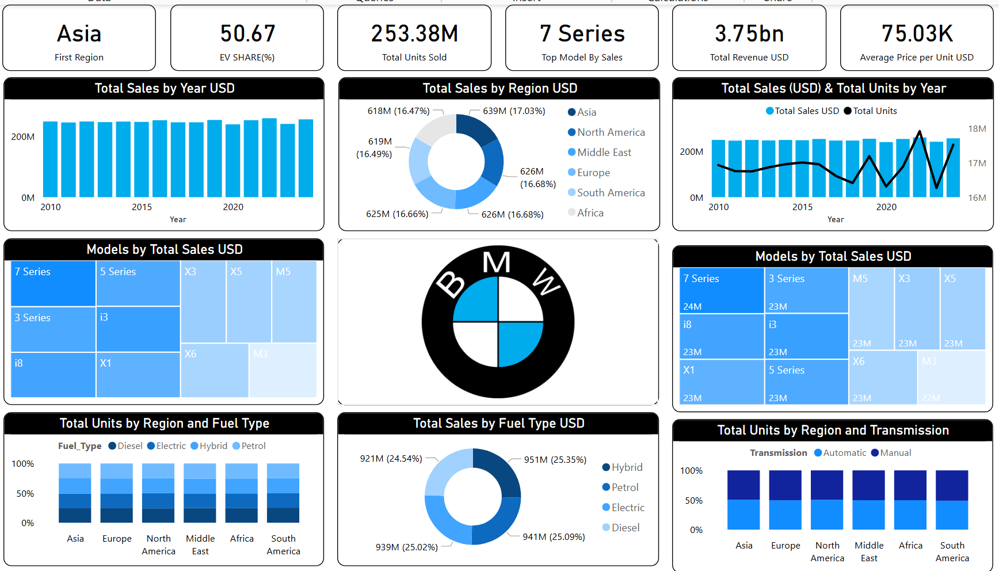

# BMW-Sales-Dashboard-2010-2024-Power-BI
Power BI dashboard analyzing BMW global sales (2010–2024) with insights on regional performance, top models, and EV adoption trends.

## Project Overview
This project presents an interactive **Power BI dashboard** analyzing BMW’s global sales performance from 2010 to 2024.

BMW operates across multiple regions with a diverse portfolio of models and fuel types. This dashboard aims to simplify complex global sales data and provide clear insights into regional performance, product trends, and the company’s transition toward electrification and sustainable mobility.

The analysis supports data-driven decision-making in areas such as:
- Market expansion
- Product strategy
- Electrification trends
- Global sales optimization

---

## Problem Statement
BMW operates in multiple regions and offers a wide range of models and fuel types. Understanding which markets, models, and powertrains drive performance over time is complex due to diverse data sources and global operations.

This project analyzes worldwide sales trends to:
- Identify top-performing regions and models
- Track revenue and unit growth
- Understand fuel type evolution
- Evaluate the shift toward electric vehicles
- Assess global market balance

---

## Dataset
The dataset contains global BMW sales data from **2010 to 2024**, including:

- Region
- Model
- Units Sold
- Revenue
- Fuel Type (Petrol, Diesel, Hybrid, Electric)
- Transmission Type
- Year
---

## Tools & Technologies
This project was developed using:

- **Power BI**
- **Power Query** (data cleaning & transformation)
- **DAX** (calculated measures & KPIs)
- Data modeling and visualization techniques

---

## Dashboard Features

### Sales Overview
- Total revenue and units sold
- Average price per unit

### Regional Analysis
- Sales distribution across global regions
- Market contribution comparison

### Model Performance
- Top-performing BMW models
- Revenue and unit comparison by model

### Fuel Type Analysis
- Distribution of Petrol, Diesel, Hybrid, and Electric vehicles
- EV adoption trends over time

### Transmission Insights
- Automatic vs Manual distribution

### Trend Analysis
- Sales and revenue trends from 2010 to 2024

---

## Key Insights

- 🌏 **Asia leads global sales**, contributing 17% of total revenue
- 💰 **Total Revenue:** $3.75B from 253M units sold
- 🚗 **Top Model:** BMW 7 Series leads in both revenue and units
- ⚡ **EV Share:** 50.67%, indicating strong electric adoption
- 💵 **Average Price:** ~$75K per unit, reflecting premium positioning
- ⛽ **Fuel Distribution:** Balanced across Petrol, Diesel, Hybrid, and Electric (~25% each)
- ⚙️ **Automatic transmissions dominate** across all regions
- 🌍 **Balanced global presence**, with each region contributing ~16–17%

---

## Dashboard Preview

---

## How to Use This Project

1. Clone or download this repository
2. Open the `.pbix` file using **Power BI Desktop**
3. Explore the interactive dashboard and filters

---

## Business Value
This dashboard provides valuable insights for:

- Strategic market expansion decisions
- Understanding customer preferences across regions
- Monitoring electrification progress
- Optimizing product portfolio
- Supporting data-driven business strategies

---

## Future Improvements

- Time-series forecasting of sales trends
- Customer segmentation analysis
- Integration with real-time data sources
- Advanced KPI dashboards
- Comparative analysis with competitors

---

## Author

**Hamed Goldoust**

Power BI | Data Analytics | Data Scientist

GitHub: https://github.com/clonerhamed
LinkedIn: https://linkedin.com/in/hamed-goldoust/
